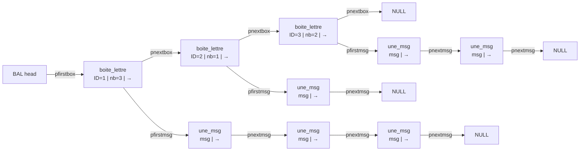

# NetworkTP — INSA Toulouse

> A school project by **Jesper Nytun** and **Tidiane Brient** at INSA Toulouse.
> *Version française en bas.*
---

## Installation

```bash
git clone https://github.com/jespernytun/NetworkTP
```

---

## tsock

Versions 1–4 are progressive implementations building toward a single program, `tsock`, capable of sending messages over the internet via **TCP** or **UDP**.

### Options (final version: `tsockv4`)

| Flag | Description |
|------|-------------|
| `-u` | UDP mode (default: TCP) |
| `-l <len>` | Message length (default: `30`) |
| `-n <num>` | Number of messages (default: `10` for sender, infinite for receiver) |
| `-p <port>` | Receiver mode |
| `-s <host> <port>` | Sender mode |

---

### tsockv1: UDP

First version. Implements a client and server using UDP.

```c
void client_udp(int port, char* hostname, int nbmsg, int lgmsg);
void server_udp(int port, int nbmsg);
```

### tsockv2: TCP

Adds TCP support alongside the existing UDP implementation.

```c
void client_tcp(int port, char* hostname, int nbmsg, int lgmsg);
void server_tcp(int port, int nbmsg);
```

### tsockv3

> **Note:** This version was planned to add `-l` and `-n` flag support which was already implemented from v1.

### tsockv4: Forking

The final version. Adds process forking so `tsock` can handle multiple connections simultaneously.

---
## Part 2 — Mailbox system (BAL)

A distributed mailbox server where senders deposit letters for named receivers, and receivers retrieve them on demand.

```bash
tsock -b <port>          # start mailbox server
tsock -e<id> -n<n> <host> <port>   # send n letters to receiver <id>
tsock -r<id> <host> <port>         # retrieve all letters for receiver <id>
```

All exchanges use TCP. The BAL server handles connections sequentially (no fork in part 2).

### Data structure


**The structs are defined as follwing**
```c
typedef struct bal_head {
  int nb_boites;
  struct boite_lettre* pfirstbox;
} bal_head;

typedef struct boite_lettre {
  int box_ID;
  int nb_msg;
  struct une_msg* pfirstmsg;     /* POINTS TOWARDS THE MESSAGES   */
  struct boite_lettre* pnextbox; /* POINTS TOWARDS NEXT LETTERBOX */
} boite_lettre;

typedef struct une_msg {
  char msg[LG_MAX_MSG];
  int lg_msg;
  struct une_msg* pnextmsg;   /* NEXT MESSAGE */
} une_msg;
```
---

