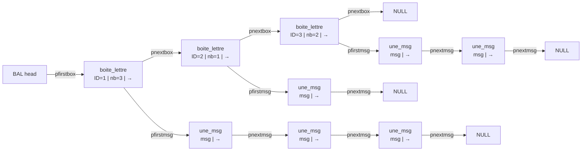

# NetworkTP — INSA Toulouse

> A school project by **Jesper Nytun** and **Tidiane Brient** at INSA Toulouse.
> 
> *[Version française en bas](#version-française)*
---

## Installation

```bash
git clone https://github.com/jespernytun/NetworkTP
gcc tsock_v5.c -o tsock
```
### Example
```bash
./tsock -p -n 100 -l 512 localhost 5000    # Start TCP server
./tsock -s -n 100 -l 512 localhost 5000    # Start TCP client
```
---

## Part 1: tsock

Versions 1–4 are progressive implementations building toward a single program, `tsock`, capable of sending messages over the internet via **TCP** or **UDP**.

### Options (final version: `tsockv4`)

| Flag | Description |
|------|-------------|
| `-u` | UDP mode (default: TCP) |
| `-l <len>` | Message length (default: `30`) |
| `-n <num>` | Number of messages (default: `10` for sender, infinite for receiver) |
| `-p <port>` | Receiver mode |
| `-s <host> <port>` | Sender mode |

---

### tsockv1: UDP

First version. Implements a client and server using UDP.

```c
void client_udp(int port, char* hostname, int nbmsg, int lgmsg);
void server_udp(int port, int nbmsg);
```

### tsockv2: TCP

Adds TCP support alongside the existing UDP implementation.

```c
void client_tcp(int port, char* hostname, int nbmsg, int lgmsg);
void server_tcp(int port, int nbmsg);
```

### tsockv3

> **Note:** This version was planned to add `-l` and `-n` flag support which was already implemented from v1.

### tsockv4: Forking

The final version. Adds process forking so `tsock` can handle multiple connections simultaneously.

---
## Part 2: Mailbox system (BAL)

A distributed mailbox server where senders deposit letters for named receivers, and receivers retrieve them on demand.

```bash
tsock -b <port>          # start mailbox server
tsock -e <id> -n<n> <host> <port>   # send n letters to receiver <id>
tsock -r <id> <host> <port>         # retrieve all letters for receiver <id>
```
### Examples
```bash
   # Terminal 1 — start BAL
   ./tsock -b 5000
   
   # Terminal 2 — send 5 letters to receiver 1
   ./tsock -e 1 -n 5 -l 30 localhost 5000
   
   # Terminal 3 — retrieve letters as receiver 1
   ./tsock -r 1 localhost 5000
```

All exchanges use TCP. The BAL server handles connections sequentially (no fork in part 2).

### Data Structure


### Justifying our datastructre
The idea is to create a datastructure that facilitates the emission and reception of data at for the BAL. The BAL keeps tracks of the total number of boxes, the boxes keep track of the total number of messages, and the messages themselves keep track of their own lengths. In particular, the fact that the messages themselves keep track of their length makes them easy to handle.

### The Protocol
Our Protocol is designed around the following initialization message

```c
struct message_init {
  int emetteur; // Defines if you wish to send or recieve messages
  int lg_msg;   // Length of messages to send to mailbox
  int nb_msg;	// Nb of messages to send to mailbox
  int id_recept; // ID of the recieving mailbox
};
```
When establishing a connection with a BAL, the sender/receptor will always send an initialization message, informing the BAL on it's intentions. In this message it will declare if it seeks to send (or recieve), and if so the length and number of messages it plans on sending. It also forwards the ID of the mailbox it wants to engage with.

### Communication with the BAL
#### Emission
After connecting with the bal and confirming yourself as a emittor, the BAL will prepare for reception. After waiting one second, you will be sending your specified number of messages of a specified length (default 10/30 if not specified). The BAL will stack the letters one by one in the mailbox marked by your ID, in order FIFO. If the mailbox is not found **a new mailbox will be created**.

#### Reception
After connecting with the bal and confirming yourself as a reciever, the BAL will send every message in the specified letterbox. Each message will be destroyed after sending, but **the mailbox itself will not be destroyed**. 

#### Known shortcomings
- If the BAL disconnects, the entrypoint to the BAL datastructure will be lost, and all the info will dissapear with it.
- There is no function to remove a mailbox once created.
- Forks have not yet been implemented, only one process can communicate with the program at the same time.

---
## What we have learned
### Linked List Implementation in C
Great refresher and introduction to linked lists, even though it's quite similar to ADA.

**Key Takeaway** Great practice.

### Protocol Design
Trying to think through and create your own protocols is a whole different approach to learning than analyzing the differences between OSI and TCP/IP architectures. Conceptualizing our `message_init` structure still proved to be a useful way to understand already established architectures, as well as dive deeper into protocol design.

**Key Takeaway:** Protocol design is hard.

### Forks and Processes
Establishing version v4 of tsock with a forking implementation was a much bigger challenge than first anticipated, taking us a whole three hours just to get it working. Great refresher on PIDs and a good introduction to the differences between concurrent and sequential servers.

**Key Takeaway:** Child processes get assigned 0 by convention — that took a long time to figure out.

### Git and Codespaces
Neither of us had ever been given a formal introduction to Git, or shared a codebase remotely before. The TP being made with many iterations in mind, and finalized with a README, made working with Git a natural choice — giving us valuable experience even though it probably cost us a fair amount of time.

**Key Takeaway:** GitHub isn't intuitive, but great for collaboration.

---

<a name="version-française"></a>

---

# NetworkTP — INSA Toulouse

> Un projet scolaire réalisé par **Jesper Nytun** et **Tidiane Brient** à l'INSA Toulouse.

---

## Installation

```bash
git clone https://github.com/jespernytun/NetworkTP
gcc tsock_v5.c -o tsock
```

### Exemple
```bash
./tsock -p -n 100 -l 512 localhost 5000    # Lancer le serveur TCP
./tsock -s -n 100 -l 512 localhost 5000    # Lancer le client TCP
```

---

## Partie 1 : tsock

Les versions 1 à 4 sont des implémentations progressives menant vers un programme unique, `tsock`, capable d'envoyer des messages sur le réseau via **TCP** ou **UDP**.

### Options (version finale : `tsockv4`)

| Flag | Description |
|------|-------------|
| `-u` | Mode UDP (défaut : TCP) |
| `-l <len>` | Longueur des messages (défaut : `30`) |
| `-n <num>` | Nombre de messages (défaut : `10` pour l'émetteur, infini pour le récepteur) |
| `-p` | Mode récepteur |
| `-s` | Mode émetteur |

---

### tsockv1 : UDP
Première version. Implémente un client et un serveur en UDP.

### tsockv2 : TCP
Ajoute le support TCP en parallèle de l'implémentation UDP existante.

### tsockv3
> **Note :** Cette version devait ajouter le support des flags `-l` et `-n`, déjà implémentés depuis la v1.

### tsockv4 : Forking
Version finale. Ajoute le fork de processus pour que `tsock` puisse gérer plusieurs connexions simultanément.

---

## Partie 2 : Système de boîte aux lettres (BAL)

Un serveur de boîtes aux lettres distribué où les émetteurs déposent des lettres pour des récepteurs identifiés, qui les récupèrent à la demande.

```bash
./tsock -b 5000                          # Démarrer le serveur BAL
./tsock -e 1 -n 5 -l 30 localhost 5000   # Envoyer 5 lettres au récepteur 1
./tsock -r 1 localhost 5000              # Récupérer les lettres en tant que récepteur 1
```

Tous les échanges utilisent TCP. Le serveur BAL gère les connexions de manière séquentielle (pas de fork dans la partie 2).

### Structure de données


### Justification de la structure de données

L'idée est de créer une structure qui facilite l'émission et la réception de données pour la BAL. La BAL garde le compte du nombre total de boîtes, les boîtes gardent le compte du nombre total de messages, et les messages eux-mêmes conservent leur propre longueur — ce qui les rend faciles à manipuler.

### Le Protocole

Notre protocole repose sur un message d'initialisation envoyé à chaque connexion :

```c
struct message_init {
  int emetteur;  // Définit si l'on souhaite envoyer ou recevoir
  int lg_msg;    // Longueur des messages à envoyer
  int nb_msg;    // Nombre de messages à envoyer
  int id_recept; // ID de la boîte aux lettres cible
};
```

### Communication avec la BAL

#### Émission
Après connexion et identification comme émetteur, la BAL se prépare à recevoir. Après une seconde d'attente, les messages sont envoyés et stockés en ordre FIFO dans la boîte du récepteur. Si la boîte n'existe pas, **elle est créée automatiquement**.

#### Réception
Après connexion et identification comme récepteur, la BAL envoie toutes les lettres de la boîte concernée. Chaque message est détruit après envoi, mais **la boîte aux lettres elle-même n'est pas supprimée**.

#### Limitations connues
- Si la BAL s'arrête, le point d'entrée de la structure de données est perdu et toutes les informations disparaissent avec.
- Il n'existe pas de fonction pour supprimer une boîte aux lettres.
- Le fork n'est pas encore implémenté — un seul processus peut communiquer avec le programme à la fois.

---

## Ce que nous avons appris

#### Implémentation de listes chaînées en C
Bon rappel et bonne introduction aux listes chaînées, même si c'est assez similaire à ADA.

**À retenir :** Pas toujours une révélation — mais une bonne pratique.

#### Conception de protocoles
Concevoir et implémenter ses propres protocoles est une approche d'apprentissage très différente de l'analyse théorique des différences entre OSI et TCP/IP. La conception de notre structure `message_init` s'est révélée être un excellent moyen de mieux comprendre les architectures existantes.

**À retenir :** La conception de protocoles, c'est difficile.

#### Forks et processus
Implémenter le fork dans la version v4 de tsock a été un défi bien plus grand qu'anticipé — trois heures rien que pour le faire fonctionner. Bon rappel sur les PIDs et bonne introduction aux différences entre serveurs concurrents et séquentiels.

**À retenir :** Les processus enfants reçoivent la valeur 0 par convention — ça nous a pris longtemps à comprendre.

#### Git et Codespaces
Aucun de nous n'avait jamais reçu de formation formelle sur Git, ni partagé une base de code à distance. Le TP étant conçu avec de nombreuses itérations en tête, Git s'est imposé naturellement — une expérience précieuse, même si cela nous a probablement coûté du temps.

**À retenir :** GitHub n'est pas intuitif, mais excellent pour la collaboration.
